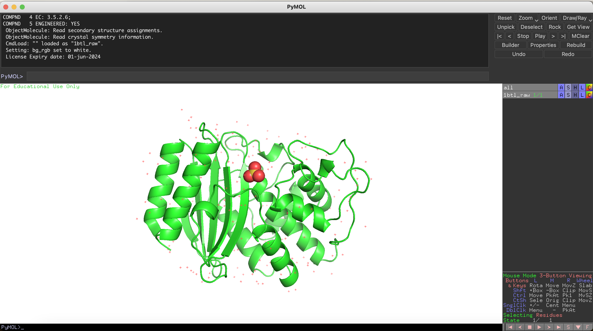
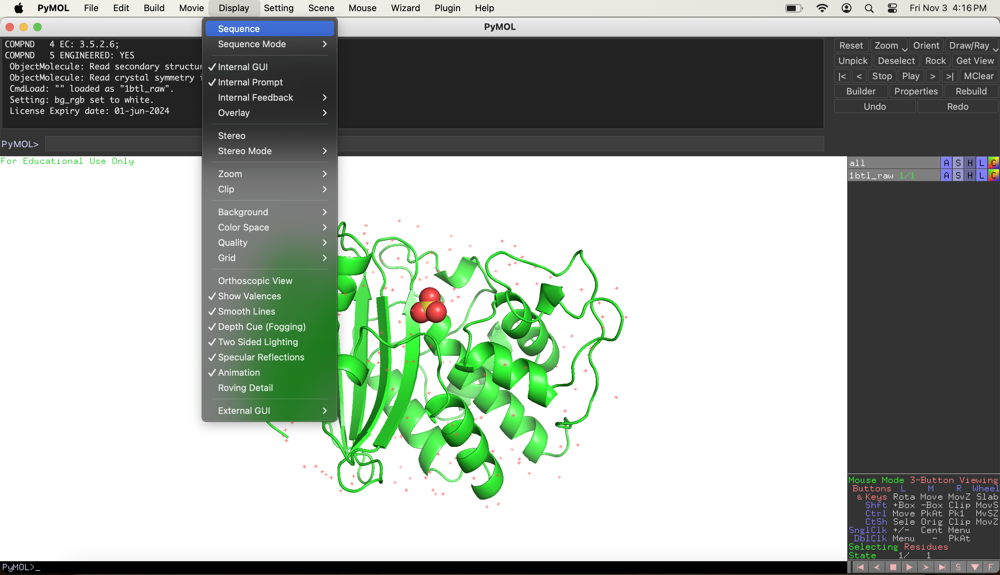
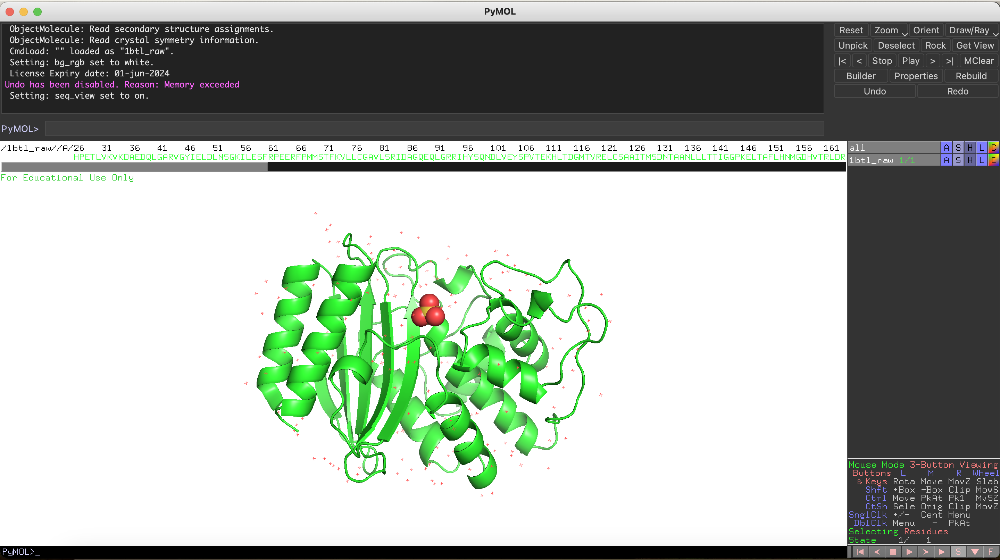
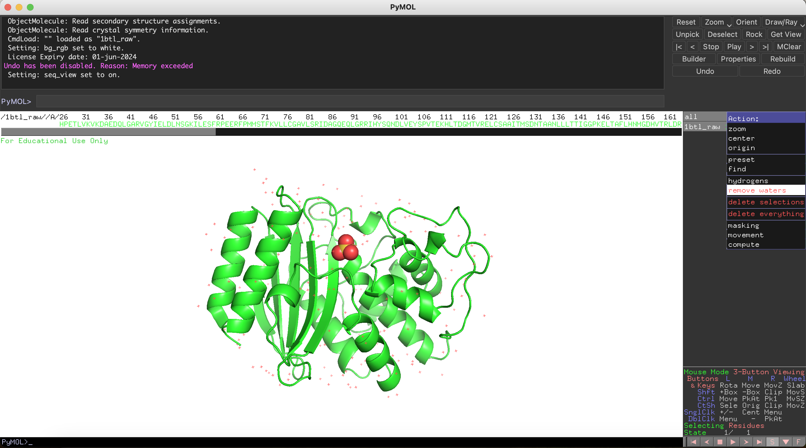
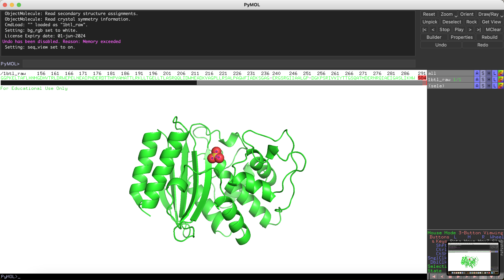
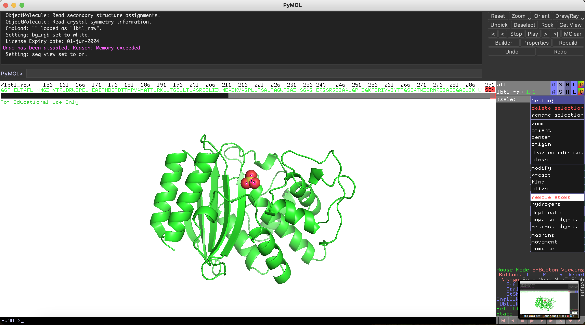
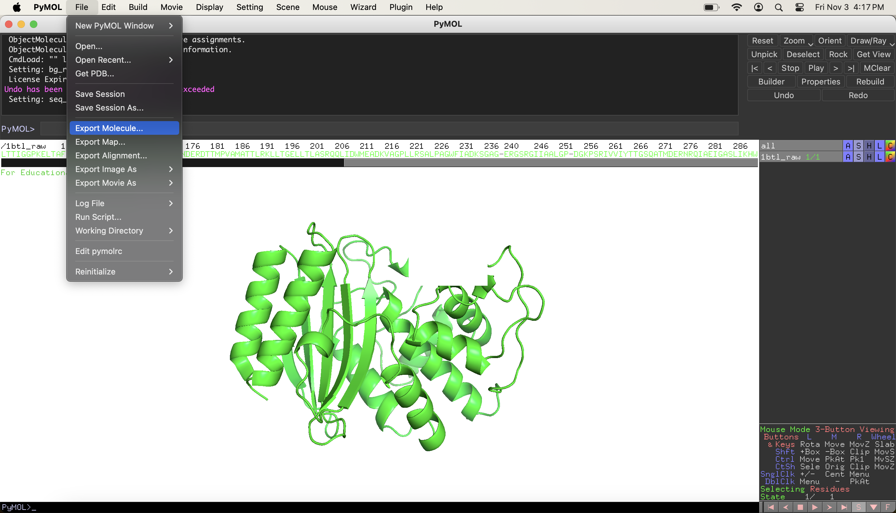
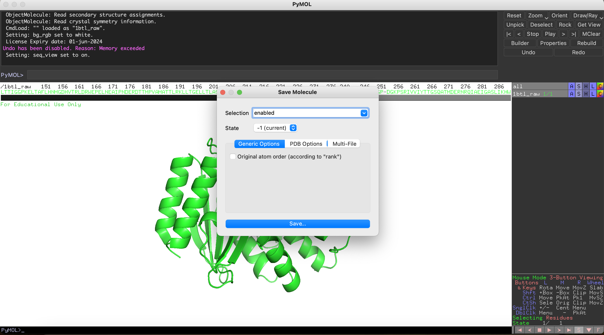
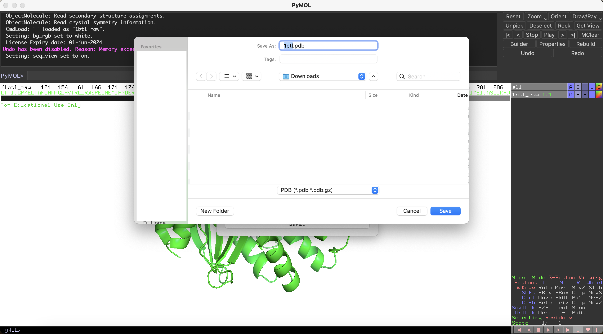

# Guide for Molecular dynamics (MD) simulations with AMBER Software on ASU Sol cluster

## Initial steps with PDB

Download PBD ID: [1BTL]

rename it as `1btl_raw.pdb`

Start PyMOL and load `1btl_raw.pdb` 



From Display show the `Sequence`



Sequence is now shown



Click `A` button next to `all` and select `remove waters` 



Scroll to the right on Sequence and click on S04



click the `A` button next to `(sele)` and click `remove atoms`



Now we are going to save the new file

Go to `File` and select `Export Molecule`



Click `Save`



Type name as `1btl` (without pdb extension) and then select `PDB` from the menu below and click `Save`



Now we created `1btl.pdb`

## Using VPN to connect to ASU network:

Run `Cisco Secure Client` VPN software

type `sslvpn.asu.adu`


Click `Connect`

when asked for username/pass use:

```
username: asuid
pass: asupass
second pass: push 
```

## Login to sol cluster

on your terminal window:

sol:

```
ssh ikazan@login.sol.rc.asu.edu
```

(change asuid to yours)

## After logging in:

`pwd` shows me home directory `/home/ikazan`

change directory to scratch space

```
cd /scratch/ikazan
```

create a new directory here by using

```
mkdir -pv testdir1
```

change directory to the new one

```
cd testdir1/
```

```
ls
```

the directory is empty

`pwd` shows me the current working directory

copy the sol path: `/scratch/ikazan/testdir1`

open a new ternminal tab (this will be connected to your own computer)

go to the directory where you have the pdb file and copy the file to sol

```
scp ./1btl.pdb ikazan@login.sol.rc.asu.edu:/scratch/ikazan/testdir1/
```

we are going to switch the termnial window to the sol session one

we are going to start an interactive session by running

```
interactive
```

## Paremetrize Protein with LEaP

Prepare `tleap.in` input file:

```
vim tleap.in
```

press `i` to enter edit mode

copy and paste the text below

```
source leaprc.protein.ff14SB
source leaprc.water.tip3p
pdb_file = loadpdb 1btl.pdb
solvateBox pdb_file TIP3PBOX 16.0
charge pdb_file
addions pdb_file Na+ 0
addions pdb_file Cl- 0
saveAmberParm pdb_file 1btl.parm7 1btl.crd
quit
```

press `esc` button on keyboard and then type `:wq`

run:

```
module load amber/22v3
```

and then run:

```
tleap -f tleap.in
```

now copy the results back to your computer

run the following commands on the terminal connected to your local computer

```
scp ikazan@login.sol.rc.asu.edu:/scratch/ikazan/testdir1/1btl.parm7 ./
```

```
scp ikazan@login.sol.rc.asu.edu:/scratch/ikazan/testdir1/1btl.crd ./
```

## Minimize Solvent

Prepare `minimization_solvent.in` input file:

```
vim minimization_solvent.in
```

press `i` to enter edit mode

copy and paste the text below

```
# Energy minimization solvent
&cntrl
imin=1,
ntpr=10000,
ntr=1,
restraintmask='!(:WAT,Na+,Cl-)',
restraint_wt=10.0,
maxcyc=50000,
ncyc=25000,
ntc=1,
ntf=1,
ntb=1,
cut=12.0,
&end
/
```

press `esc` button on keyboard and then type `:wq`

### Interactive mode

make sure you have `interactive` session and run:

```
module load amber/22v3
``` 

run:

```
pmemd -O \
-i minimization_solvent.in \
-o minimization_solvent.out \
-p 1btl.parm7 \
-c 1btl.crd \
-r 1btl_minimization_solvent.rst7 \
-x 1btl_minimization_solvent.crd \
-ref 1btl.crd
```

### Batch mode

Prepare `minimization_solvent_sbatch` file:

```
vim minimization_solvent_sbatch
```

press `i` to enter edit mode

copy and paste the text below

```
#!/usr/bin/env bash
#SBATCH -N 1
#SBATCH -c 6
#SBATCH -G a100:1
#SBATCH -p general
#SBATCH -t 1-00:00:00
#SBATCH -o slurm.%j.out
#SBATCH -e slurm.%j.err

module load amber/22v3

mpiexec.hydra -n 6 pmemd.MPI -O \
-i minimization_solvent.in \
-o minimization_solvent.out \
-p 1btl.parm7 \
-c 1btl.crd \
-r 1btl_minimization_solvent.rst7 \
-x 1btl_minimization_solvent.crd \
-ref 1btl.crd
```

run

```
sbatch minimization_solvent_sbatch
```

#### After the step is complete, copy the files to your computer

```
scp ikazan@login.sol.rc.asu.edu:/scratch/ikazan/testdir1/minimization_solvent.out ./
```

```
scp ikazan@login.sol.rc.asu.edu:/scratch/ikazan/testdir1/1btl_minimization_solvent.rst7 ./
```

## Minimize Solution

Prepare `minimization_solution.in` input file:

```
vim minimization_solution.in
```

press `i` to enter edit mode

copy and paste the text below

```
# Energy minimization solution
&cntrl
imin=1,
ntpr=10000,
maxcyc=100000,
ncyc=50000,
ntc=1,
ntf=1,
ntb=1,
cut=12.0,
&end
/
```

press `esc` button on keyboard and then type `:wq`

### Interactive mode

make sure you have `interactive` session and run:

```
module load amber/22v3
``` 
run:

```
pmemd -O \
-i minimization_solution.in \
-o minimization_solution.out \
-p 1btl.parm7 \
-c 1btl_minimization_solvent.rst7 \
-r 1btl_minimization_solution.rst7 \
-x 1btl_minimization_solution.crd
```

### Batch mode

Prepare `minimization_solution_sbatch` file:

```
vim minimization_solution_sbatch
```

press `i` to enter edit mode

copy and paste the text below

```
#!/usr/bin/env bash
#SBATCH -N 1
#SBATCH -c 6
#SBATCH -G a100:1
#SBATCH -p general
#SBATCH -t 1-00:00:00
#SBATCH -o slurm.%j.out
#SBATCH -e slurm.%j.err

module load amber/22v3

mpiexec.hydra -n 6 pmemd.MPI -O \
-i minimization_solution.in \
-o minimization_solution.out \
-p 1btl.parm7 \
-c 1btl_minimization_solvent.rst7 \
-r 1btl_minimization_solution.rst7 \
-x 1btl_minimization_solution.crd
```

press `esc` button on keyboard and then type `:wq`

run

```
sbatch minimization_solution_sbatch
```

## Heat up System

Prepare `heatup.in` input file:

```
vim heatup.in
```

press `i` to enter edit mode

copy and paste the text below

```
# Heat Up 100ps
&cntrl
imin=0,
ntx=1,
irest=0,
ntpr=5000,
ntwr=5000,
iwrap=1,
ntwx=5000,
ntr=1,
restraintmask='!(:WAT,Na+,Cl-)',
restraint_wt=10.0,
nstlim=50000,
dt=0.002,
ntt=3,
temp0=300.0,
tempi=0.0,
ig=-1,
tautp=1.0,
gamma_ln=2.0,
ntp=0,
taup=2.0,
ntc=2,
ntf=2,
ntb=1,
cut=12.0,
&end
/
```

press `esc` button on keyboard and then type `:wq`

### Interactive mode

make sure you have `interactive` session and run:

```
module load amber/22v3
``` 

run:

```
pmemd -O \
-i heatup.in \
-o heatup.out \
-p 1btl.parm7 \
-c 1btl_minimization_solution.rst7 \
-r 1btl_heatup.rst7 \
-x 1btl_heatup.crd \
-ref 1btl_minimization_solution.rst7
```

### Batch mode

Prepare `heatup_sbatch` file:

```
vim heatup_sbatch
```

press `i` to enter edit mode

copy and paste the text below

```
#!/usr/bin/env bash
#SBATCH -N 1
#SBATCH -c 6
#SBATCH -G a100:1
#SBATCH -p general
#SBATCH -t 1-00:00:00
#SBATCH -o slurm.%j.out
#SBATCH -e slurm.%j.err

module load amber/22v3

mpiexec.hydra -n 6 pmemd.MPI -O \
-i heatup.in \
-o heatup.out \
-p 1btl.parm7 \
-c 1btl_minimization_solution.rst7 \
-r 1btl_heatup.rst7 \
-x 1btl_heatup.crd \
-ref 1btl_minimization_solution.rst7
```

press `esc` button on keyboard and then type `:wq`

run

```
sbatch heatup_sbatch
```

## Production NPT (CPU)

Prepare `production_npt_cpu.in` input file:

```
vim production_npt_cpu.in
```

press `i` to enter edit mode

copy and paste the text below

```
# Production 100ps
&cntrl
imin=0,
ntx=5,
irest=1,
ntpr=5000,
ntwr=5000,
iwrap=1,
ntwx=5000,
nstlim=50000,
dt=0.002,
ntt=3,
temp0=300.0,
ig=-1,
tautp=1.0,
gamma_ln=2.0,
ntp=1,
taup=2.0,
ntc=2,
ntf=2,
ntb=2,
cut=12.0,
&end
/
```

press `esc` button on keyboard and then type `:wq`

### Interactive mode

make sure you have `interactive` session and run:

```
module load amber/22v3
``` 

run:

```
pmemd -O \
-i production_npt_cpu.in \
-o production_npt_cpu.out \
-p 1btl.parm7 \
-c 1btl_heatup.rst7 \
-r 1btl_production_npt_cpu.rst7 \
-x 1btl_production_npt_cpu.crd
```

### Batch mode

Prepare `production_npt_cpu_sbatch`  file:

```
vim production_npt_cpu_sbatch
```

press `i` to enter edit mode

copy and paste the text below

```
#!/usr/bin/env bash
#SBATCH -N 1
#SBATCH -c 6
#SBATCH -G a100:1
#SBATCH -p general
#SBATCH -t 1-00:00:00
#SBATCH -o slurm.%j.out
#SBATCH -e slurm.%j.err

module load amber/22v3

mpiexec.hydra -n 6 pmemd.MPI -O \
-i production_npt_cpu.in \
-o production_npt_cpu.out \
-p 1btl.parm7 \
-c 1btl_heatup.rst7 \
-r 1btl_production_npt_cpu.rst7 \
-x 1btl_production_npt_cpu.crd
```

press `esc` button on keyboard and then type `:wq`

run

```
sbatch production_npt_cpu_sbatch
```

## Production NPT (GPU)

Prepare `production_npt_gpu.in` input file:

```
vim production_npt_gpu.in
```

press `i` to enter edit mode

copy and paste the text below

```
# Production 20ns
&cntrl
imin=0,
ntx=5,
irest=1,
ntpr=5000,
ntwr=5000,
iwrap=1,
ntwx=5000,
ntwv=-1,
ioutfm=1,
nstlim=10000000,
dt=0.002,
ntt=3,
temp0=300.0,
ig=-1,
tautp=1.0,
gamma_ln=2.0,
ntp=1,
taup=2.0,
ntc=2,
ntf=2,
ntb=2,
cut=12.0,
&end
/
```

press `esc` button on keyboard and then type `:wq`

### Interactive mode

make sure you have GPU active session

```
interactive -G a100:1
```

run:

```
module load amber/22v3
``` 

run:

```
pmemd.cuda -O \
-i production_npt_gpu.in \
-o production_npt_gpu.out \
-p 1btl.parm7 \
-c 1btl_production_npt_cpu.rst7 \
-r 1btl_production_npt_gpu.rst7 \
-x 1btl_production_npt_gpu.nc
```

### Batch mode

Prepare `production_npt_gpu_sbatch`  file:

```
vim production_npt_gpu_sbatch
```

press `i` to enter edit mode

copy and paste the text below

```
#!/usr/bin/env bash
#SBATCH -N 1
#SBATCH -c 6
#SBATCH -G a100:1
#SBATCH -p general
#SBATCH -t 1-00:00:00
#SBATCH -o slurm.%j.out
#SBATCH -e slurm.%j.err

module load amber/22v3

pmemd.cuda -O \
-i production_npt_gpu.in \
-o production_npt_gpu.out \
-p 1btl.parm7 \
-c 1btl_production_npt_cpu.rst7 \
-r 1btl_production_npt_gpu.rst7 \
-x 1btl_production_npt_gpu.nc
```

press `esc` button on keyboard and then type `:wq`

run

```
sbatch production_npt_gpu_sbatch
```

## Get the pdb file from the simulation

make sure you have `interactive` session and run:

```
module load amber/22v3
``` 

Prepare `get_pdb.in` input file:

```
vim get_pdb.in
```

press `i` to enter edit mode

copy and paste the text below

```
parm 1btl.parm7
trajin 1btl_production_npt_gpu.nc
trajout struct pdb offset 100 multi
```

press `esc` button on keyboard and then type `:wq`

run:

```
cpptraj -i get_pdb.in
```

This will generate many files named `struct***.pdb`, we are going to grab the one with the largest number indicating the last frame of the simulation and rename it `last.pdb`.

[1BTL]: https://files.rcsb.org/download/1BTL.pdb
